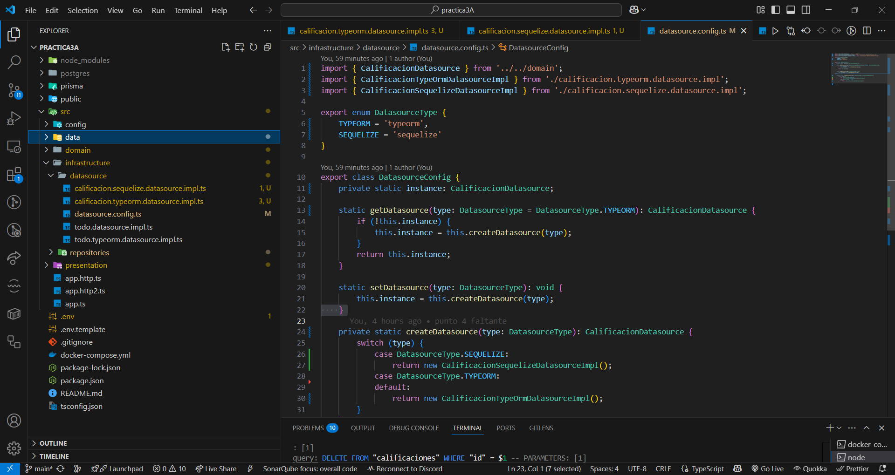
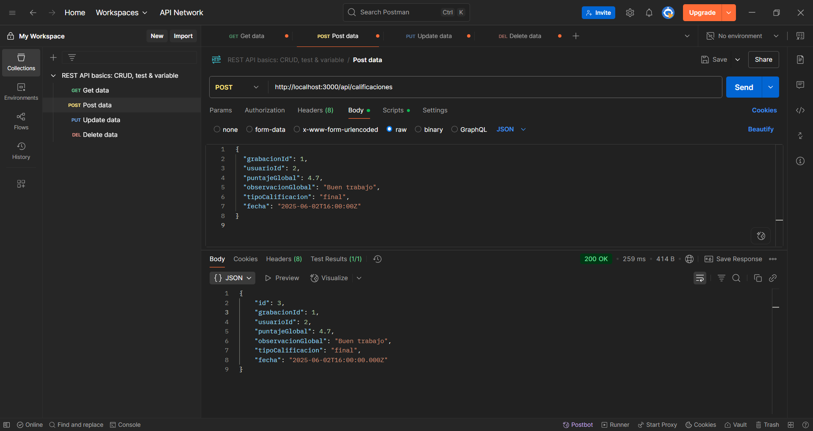
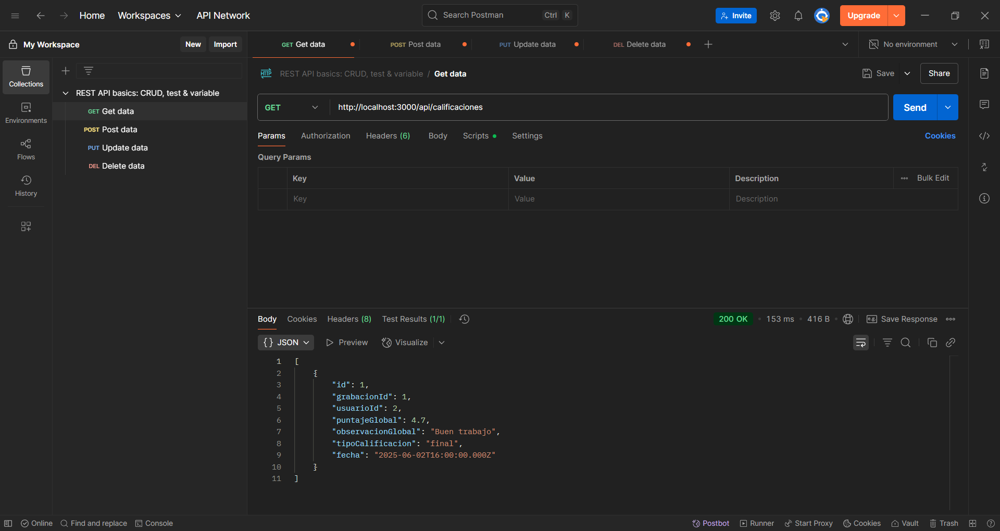
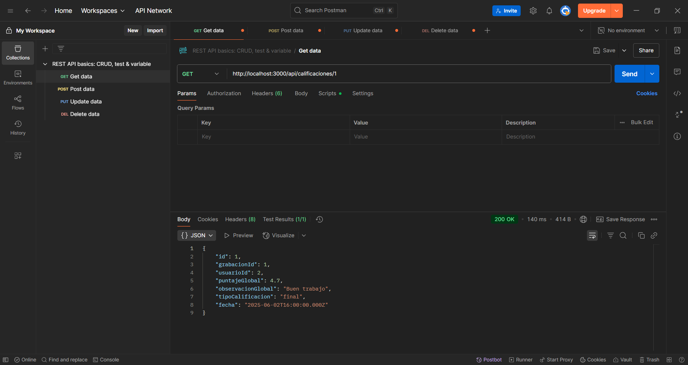
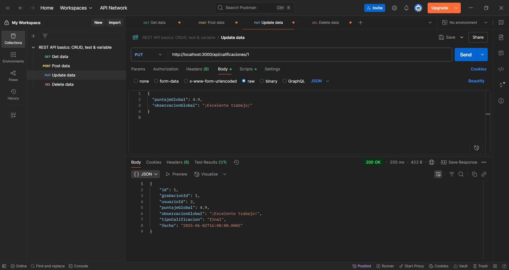
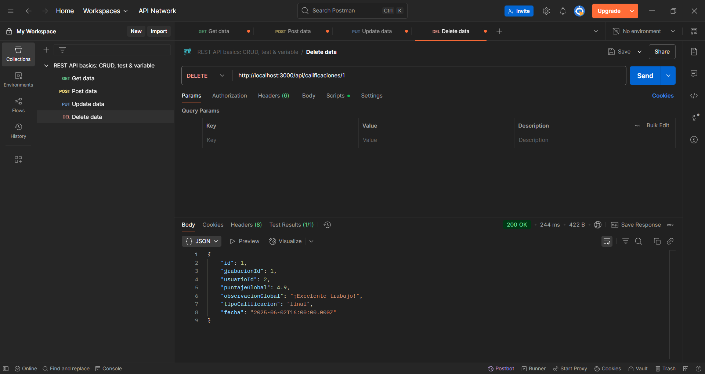
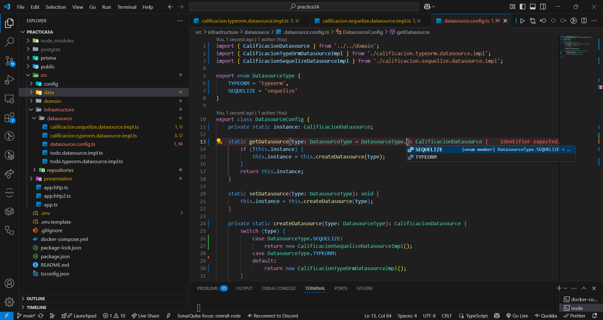
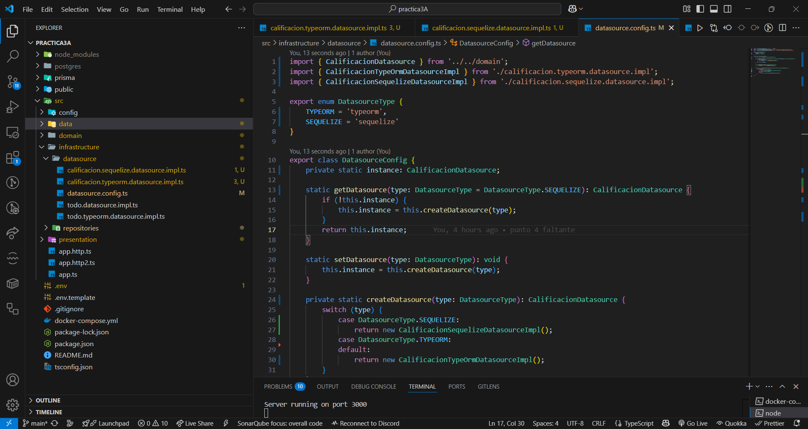
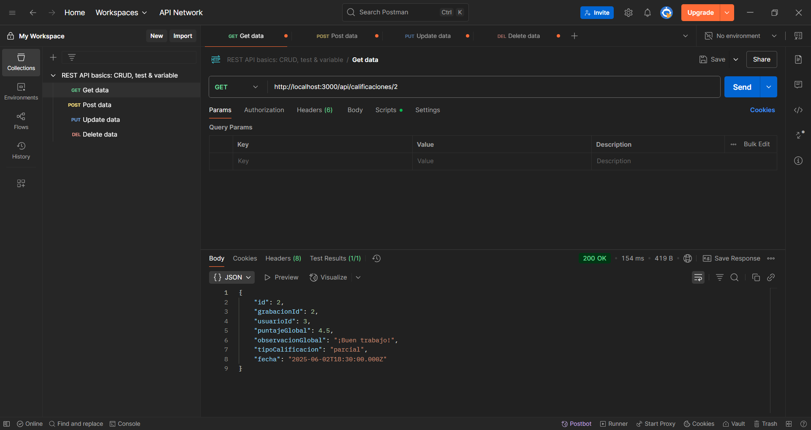
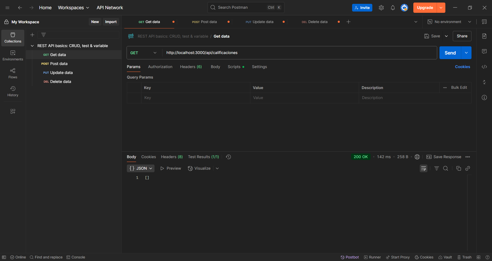

# Práctica 3A - Arquitectura N-Capas: TypeORM y Sequelize

Este proyecto implementa la entidad `Calificacion` con arquitectura N-Capas, desacoplada de la infraestructura, permitiendo el uso de múltiples ORMs (TypeORM y Sequelize).

---

## 🚀 Instrucciones para ejecutar el proyecto

### **Requisitos**
- Docker y Docker Compose
- Node.js (solo si corres la app fuera de Docker)
- Git

### **1. Clonar el repositorio**

```bash
git clone https://github.com/CarlosJChileS/servidor-web.git
cd 1parcial/practica3A
````

### **2. Configurar las variables de entorno**

Copia el archivo `.env.template` a `.env`:

```bash
cp .env.template .env
```

Asegúrate de que los valores coincidan con los del docker-compose.

### **3. Levantar los servicios con Docker Compose**

```bash
docker-compose up --build
```

Esto inicia la base de datos y la aplicación si la tienes como servicio.
Si ejecutas la app por fuera de Docker Compose:

```bash
npm install
npm run dev
```

---

## 📚 Endpoints REST de Calificación

Todos los endpoints usan el path `/api/calificaciones`

* **POST** `/api/calificaciones` – Crear una calificación
* **GET** `/api/calificaciones` – Listar todas las calificaciones
* **GET** `/api/calificaciones/:id` – Obtener una calificación por ID
* **PUT** `/api/calificaciones/:id` – Actualizar una calificación
* **DELETE** `/api/calificaciones/:id` – Eliminar una calificación

---

## 🖼️ Evidencias y pruebas (screenshots)

### **TypeORM**

* **Conexión exitosa:**
  
* **Crear (POST):**
  
* **Obtener todas (GET):**
  
* **Obtener por ID (GET):**
  
* **Actualizar (PUT):**
  
* **Eliminar (DELETE):**
  
* **GET después del DELETE:**
  

---

### **Cambio de ORM a Sequelize**

* **Configuración:**
  

### **Sequelize**

* **Conexión exitosa:**
  
* **Crear (POST):**
  
* **Obtener todas (GET):**
  
* **Obtener por ID (GET):**
  
* **Actualizar (PUT):**
  
* **Eliminar (DELETE):**
  
* **GET después del DELETE:**
  

---

## ⚡ Cómo cambiar de ORM

Para usar otro ORM solo cambia la configuración en el archivo de datasource:

* **TypeORM:**

  ```typescript
  const datasource = DatasourceConfig.getDatasource(DatasourceType.TYPEORM);
  ```
* **Sequelize:**

  ```typescript
  const datasource = DatasourceConfig.getDatasource(DatasourceType.SEQUELIZE);
  ```

Agrega nuevos ORMs creando una clase que implemente el datasource y registrándola en el config.

---

## ✨ Consideraciones

* El dominio está completamente desacoplado de la infraestructura (basta cambiar la config para usar otro ORM).
* Pruebas exitosas y capturas de cada endpoint y operación.
* Estructura lista para escalar y agregar nuevas entidades/ORMs.
* No olvides usar `synchronize: false` en producción y manejar migraciones.

---

## 👨‍💻 Autor

* Carlos Junior Chile Silva

---

**¡Entrega lista! 🚀**

