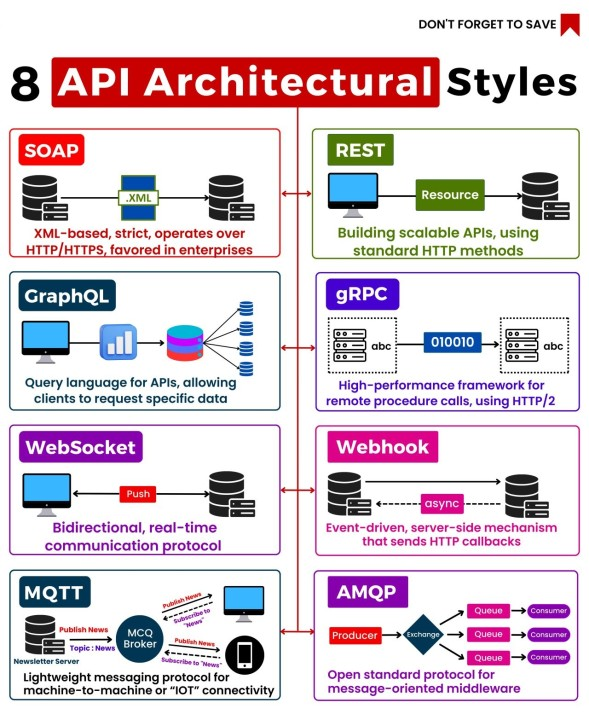
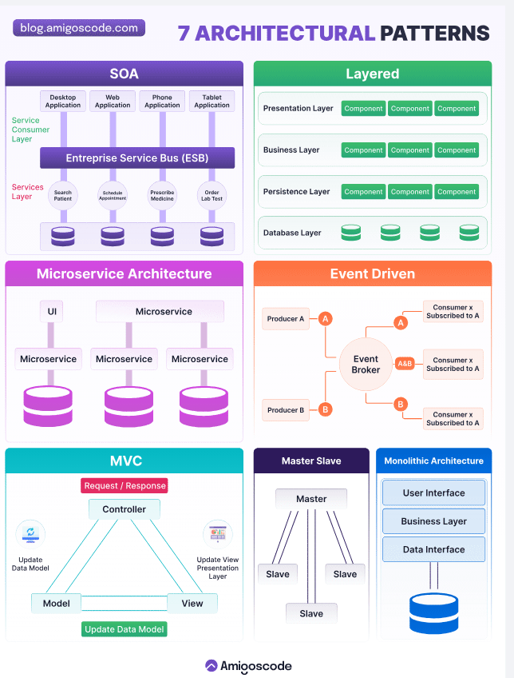

# Semana 5.1
# SERVICIO REST: Diseno, implementacion,seguridad y despliegue de APIS modernas
## mas tomado en cuneta para el examen
 - la mas comun por la facilidad de implementacion es *REST* 
 - Soap no es una base empresarial sino mas bein para banco, entidades gobernamentales XML
 - GraphQL para trabajar con una api mas estructurada en tiempo real
 - WebSocket comunicacion bidirecional continua con el cliente
 - el mas antiguo es el gRPC un cliente php con una base de datos
 todos son la forma de trabajar con api pero depende del entorno
- MQTT Y AMQP son super antiguos  
- Webhook se usa para los pagos

- arquitectura de microservisos y soa son agnosticas pueden estar desarrollados en diferentes tecnologias
- arquitectura monolitico tiene solo un punto de entrada
# Que es un Servicio REST?
Basado en HTTP Accede y modifica recursos mediante URLs
- Estilo arquitectonico: Disenado para construir APIs web modernas
- Estructura de rutas/recursos agnostico
- Ampliamente adoptado: ligero y altamente escalable
* API: puente
* API REST: se basa en tipo de recursos, puede ser una imagen , datos, documentos
## Fundamentos web para REST
- HTTP y sus metodos: GET, POST, PUT, DELETE, PATCH
- Formatos de datos: JSON o XML como estandares
- Codigo de estado: 200 (ok), 404( No enconrado), 500(Error)
- Modelo Cliente-servidor: Sepearacion clara de responsabilidades
## Principios RESTful  diseno de rutas
- *  Interfaz uniforme: Operaciones consistentes
- - * * sin estado(stateless): Cada peticion es independiente
- - * * * URL como recursos: /usuarios(localhost:2000/api/usuarios), /productos/1/comentarios
- - * * * * Versionameinto: /api/v1/ para evolucion controlada
## Metodos HTPP EN REST
- get
- delete
- post
- put
- patch 
Crear un servidor REST con Express.js